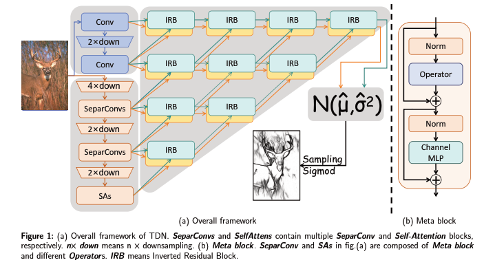
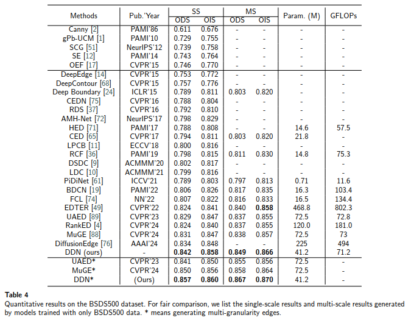

# A Doubly Decoupled Network for Edge Detection
This is the official source code of paper "[A Doubly Decoupled Network for Edge Detection](https://www.sciencedirect.com/science/article/pii/S0925231225001146)" (DDN), which is accepted by Neurocomputing.

## 1. abstract
Deep learning-based edge detectors are increasingly scaled up to achieve higher performance. However, this growth comes at the cost of higher computational demands and a greater risk of
model overfitting. In this paper, a Doubly Decoupled Network (DDN) is proposed to alleviate these problems by decoupling the data and features separately. Firstly, we decouple image-edge pairs and
build learnable Gaussian distributions. The images are mapped to learnable Gaussian distributions, and the corresponding edges are mapped to samples of the distributions. More robust features are
generated by normalizing the latent variables and sampling from the Gaussian distributions. Secondly, we compress the redundant calculations by decoupling image features. Shallow features need not only
high resolution to provide accurate spatial information, but also diversity to provide sufficient cues for deep features. We decouple image features into spatial and semantic features and encode them
separately. Shallow features no longer provide cues for semantic features and their diversity can be drastically compressed. The proposed DDN achieves the state-of-the-art accuracy across multiple
edge detection benchmarks, while the computational cost is similar to that of VGG-based methods.


## 2. Structure


## 3. Experimental result




## 4. Production

### 4.1 Environmental preparation
**Download the project**
```angular2html
git clone git@github.com:Li-yachuan/DDN.git
```
**Install the requirement packages**
Torch-related packages need to be installed manually.
DDN is quite robust to the environment. If the same environment cannot be configured due to CUDA version issues, it can work with a relatively close basic one

```angular2html
pip install -r requirements.txt
```

### 4.2 Prepare dataset

**BSDS500:** following the setting of [MuGE](https://github.com/ZhouCX117/UAED_MuGE),
and the data can be download from [the link](https://drive.google.com/file/d/1iB2aUKTjDK0URbvUXbXBKBYAROftRKwX/view?usp=sharing)

put the unziped data to any path (such as "/data/users/liyachuan/dataset/BSDS")

And Change **data_pth** in config/BSDS-DDN_M36.yaml to **data_pth: /data/users/liyachuan/dataset/BSDS**

### Prepare pretrained ckpt


### 4.3 Training the model 
```angular2html
python main.py  --output 0501-bsds --cfg config/BSDS-DDN_M36.yaml
```
### 4.4 Test
```angular2html
python main.py  --output 0501-bsds-test --cfg config/BSDS-DDN_M36.yaml --mode test --resume [path of ckpt] --mg --ms
```
**mg** means generating multi-granularity edges
**ms** means generating multi-scale edges

### 4.5 Eval

Following MuGE, the single-granularity evalution depend on the Matlab package.

And the multi-granularity edges evalution by the commond
```angular2html
python eval_muge_best/best_ods_ois.py [multi-granularity edges dir]
```
more detail can be found in [MuGE](https://github.com/ZhouCX117/UAED_MuGE)

### 4.6 Other datasets
**NYUDv2** following [RCF](https://github.com/yun-liu/RCF), and config the **data_pth** in file "config/NYUD-DDN_M36.yaml"  
**BIPED** following [DexiNed](https://github.com/xavysp/DexiNed), and config the **data_pth** in file "config/BIPED-DDN_M36.yaml"

The edges of these two datasets are in png format, which is different from the mat format of BSDS. This does not affect their usage.

# Acknowledgement & Citation

```angular2html
@inproceedings{liu2017richer,
  title={Richer convolutional features for edge detection},
  author={Liu, Yun and Cheng, Ming-Ming and Hu, Xiaowei and Wang, Kai and Bai, Xiang},
  booktitle={Proceedings of the IEEE conference on computer vision and pattern recognition},
  pages={3000--3009},
  year={2017}
}
```

```angular2html
@inproceedings{poma2020dense,
  title={Dense extreme inception network: Towards a robust cnn model for edge detection},
  author={Poma, Xavier Soria and Riba, Edgar and Sappa, Angel},
  booktitle={Proceedings of the IEEE/CVF winter conference on applications of computer vision},
  pages={1923--1932},
  year={2020}
}
```
```
@inproceedings{zhou2024muge,
  title={Muge: Multiple granularity edge detection},
  author={Zhou, Caixia and Huang, Yaping and Pu, Mengyang and Guan, Qingji and Deng, Ruoxi and Ling, Haibin},
  booktitle={Proceedings of the IEEE/CVF Conference on Computer Vision and Pattern Recognition},
  pages={25952--25962},
  year={2024}
}
```

```
@article{li2024new,
  title={A new baseline for edge detection: Make Encoder-Decoder great again},
  author={Li, Yachuan and Pomab, Xavier Soria and Xi, Yongke and Li, Guanlin and Yang, Chaozhi and Xiao, Qian and Bai, Yun and LI, Zongmin},
  journal={arXiv preprint arXiv:2409.14976},
  year={2024}
}
```

